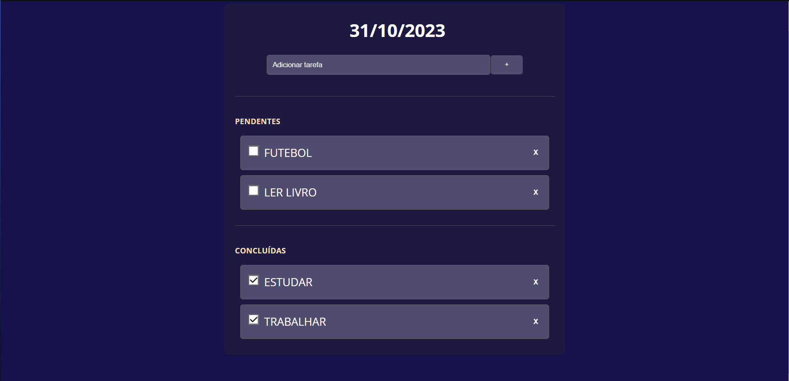

<h1 align="center"> TASKSLY </h1>

Lista De Tarefas 

  <a href="#-tecnologias">Tecnologias</a>&nbsp;&nbsp;&nbsp;|&nbsp;&nbsp;&nbsp;
  <a href="#-projeto">Projeto</a>&nbsp;&nbsp;&nbsp;|&nbsp;&nbsp;&nbsp;
  <a href="#memo-recursos">Recurso</a>&nbsp;&nbsp;&nbsp;|&nbsp;&nbsp;&nbsp;
  <a href="#contribuição">Contribuição</a>&nbsp;&nbsp;&nbsp;|&nbsp;&nbsp;&nbsp;
  <a href="#memo-licença">Licença</a>

  

 

  

## 🚀 Tecnologias

Esse projeto foi desenvolvido com as seguintes tecnologias:

- HTML e CSS
- JavaScript
- Git e Github

## 💻 Projeto

Tasksly é uma aplicação simples de lista de tarefas desenvolvida em HTML, CSS e JavaScript. Permite que os usuários adicionem, removam e marquem tarefas como concluídas..

- [Acesse o projeto finalizado, online](https://github.com/GabrielSantos777/tasksly)

## :memo: Recursos

- Adicionar Tarefa: Os usuários podem adicionar novas tarefas digitando o texto na caixa de entrada e pressionando Enter ou clicando no botão de adicionar (+).
- Remover Tarefa: As tarefas podem ser removidas clicando no botão "X" ao lado delas.
- Marcar como Concluída: As tarefas podem ser marcadas como concluídas clicando na caixa de seleção ao lado delas. Tarefas concluídas são movidas para a seção "CONCLUÍDAS".
- Data Atual: A aplicação exibe a data atual no formato DD/MM/AAAA na parte superior.

## Contribuição

Contribuições são bem-vindas! Sinta-se à vontade para criar problemas (issues) ou enviar solicitações de pull (pull requests) para melhorias ou correções.

## :memo: Licença

Esse projeto está sob a licença MIT.

---

*Este projeto foi desenvolvido por [Gabriel Santos](https://github.com/GabrielSantos777).*